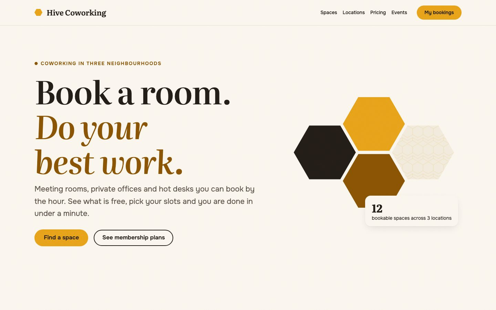
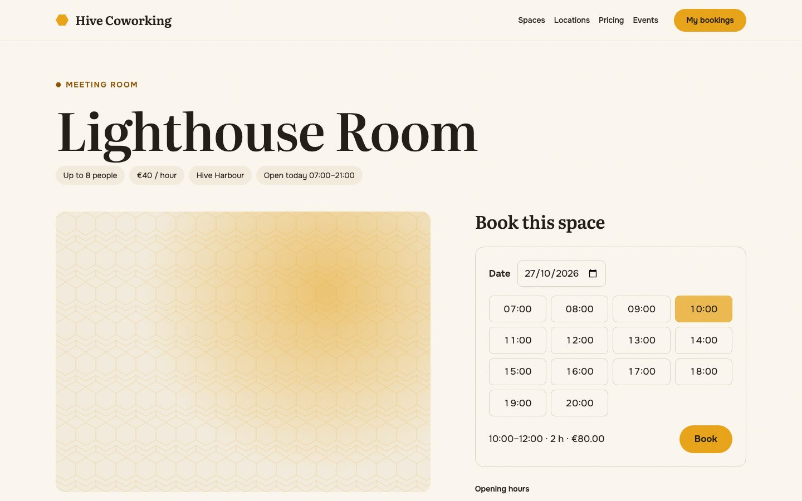
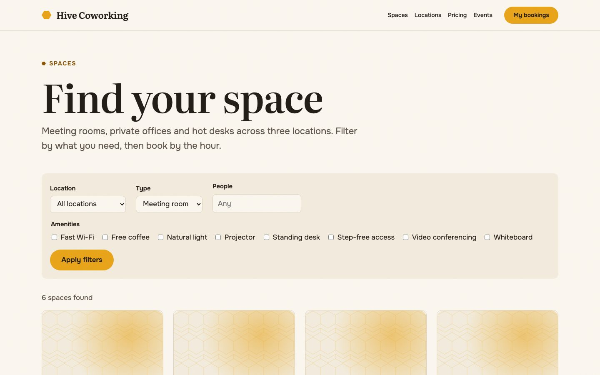
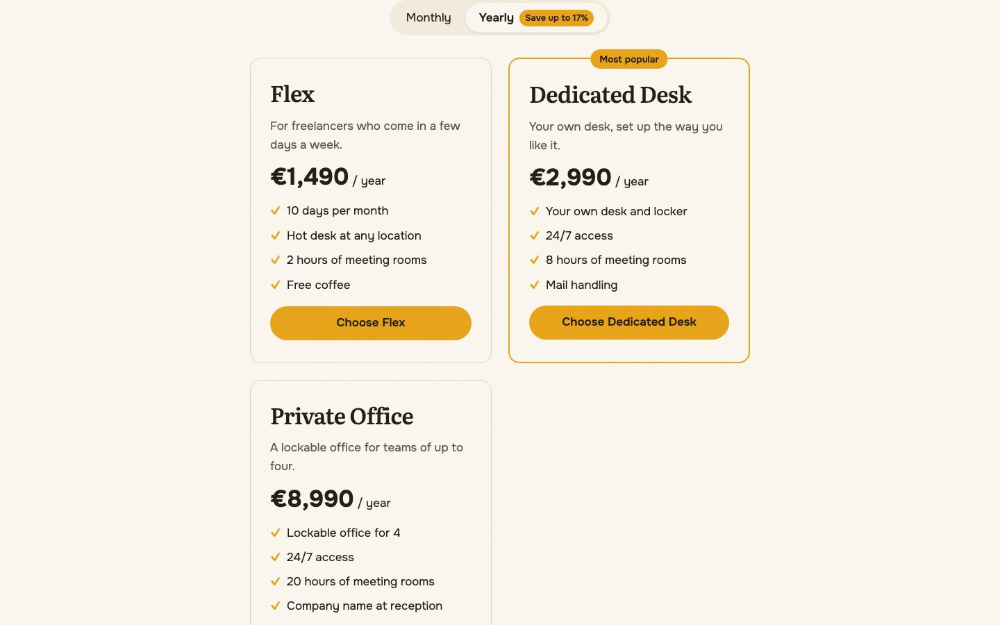
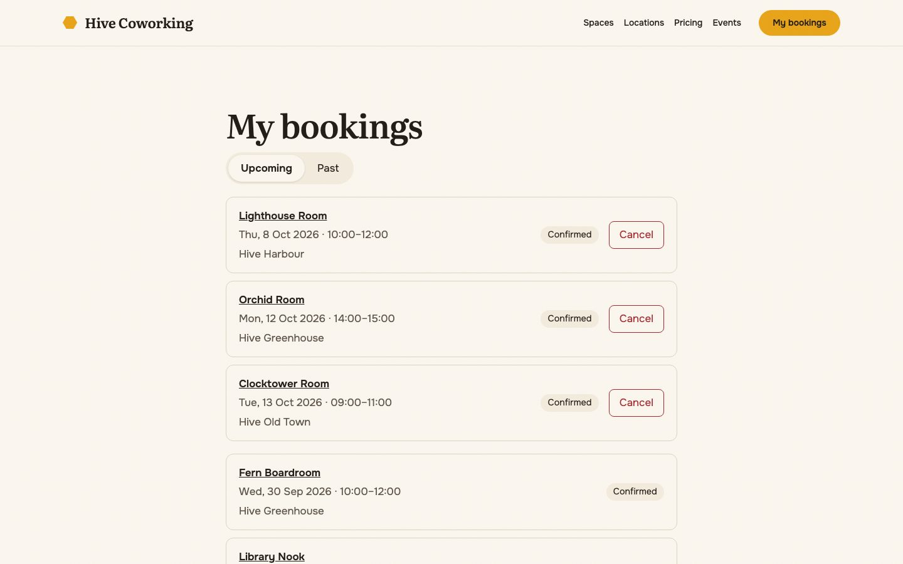
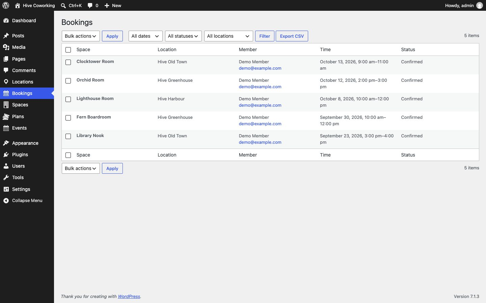
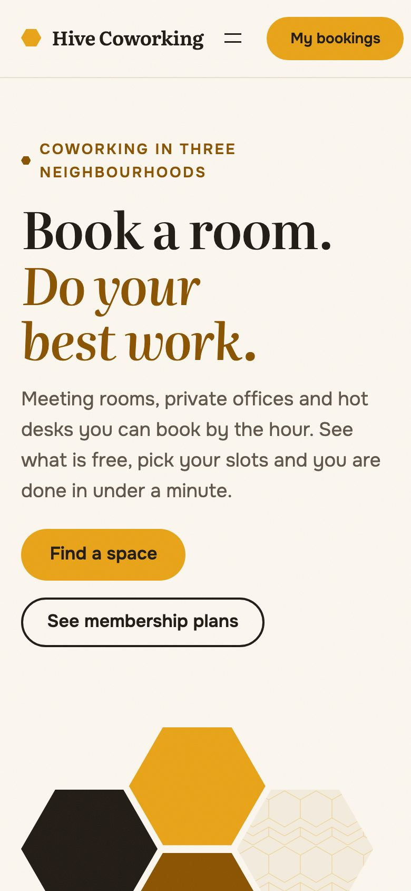

# Hive Coworking

[](https://github.com/YevhenTiutiunnyk/hive-coworking/actions/workflows/ci.yml)


A full-stack WordPress project for a fictional coworking network: a **block theme** and a
**booking plugin** with its own database table, REST API, Gutenberg blocks, the Interactivity
API, WP-CLI commands, emails, a complete Russian translation and tests at every level.

**[▶ Try the live demo](https://playground.wordpress.net/?blueprint-url=https://yevhentiutiunnyk.github.io/hive-coworking/blueprint.json)**
(logged in as a member, book a room) ·
**[Open the admin](https://playground.wordpress.net/?blueprint-url=https://yevhentiutiunnyk.github.io/hive-coworking/blueprint-admin.json)**

The demo runs entirely in your browser with WordPress Playground (PHP in WebAssembly, SQLite).
Nothing is saved.



## What it does

- **Room booking.** Members pick a date and one or more consecutive slots, see the price and book.
  Slots are rendered on the server, then the Interactivity API takes over. Bookings are checked
  against opening hours, notice, maximum length and overlap, under a per-space lock, so two
  people can never book the same hour.
- **Space finder.** Filters by location, type, capacity and amenities live in the URL. Without
  JavaScript it is a plain form; with it, the Interactivity Router swaps in server-rendered results.
- **My bookings.** Upcoming and past bookings, cancellation up to a configurable deadline.
- **Pricing and events.** Plan comparison with a monthly / yearly switch, upcoming events with
  an *Add to calendar* `.ics` download.
- **Admin.** A bookings screen with filters, bulk cancel and CSV export; a dashboard widget with
  today's occupancy; a settings page for the booking rules.
- **Emails.** HTML confirmation and cancellation emails in the member's own language.
- **WP-CLI.** `wp hive seed` creates the demo content; `wp hive bookings list` reports bookings.
- **Theme.** A warm editorial block theme with a honeycomb motif, a dark *Night Shift* variation,
  translatable patterns and templates for every view.

| | |
|---|---|
|  |  |
|  |  |
|  |  |

## How it is built

```
hive-coworking/
├── plugins/hive-core/        Data and business logic
│   ├── src/Bookings/         Domain: rules, slots, lock, service, repository (custom table)
│   ├── src/Rest/             REST controllers
│   ├── src/Blocks/           Server side of the blocks, Block Bindings source
│   ├── src/Admin/            List table, CSV export, dashboard widget, settings
│   ├── blocks/               Block sources (React editor UI, Interactivity API view scripts)
│   └── tests/                PHPUnit unit and integration tests
├── themes/hive/              Presentation only: theme.json, templates, patterns
├── tests/e2e/                Playwright end-to-end tests
└── tools/                    Packaging, translations, Playground blueprints
```

Some decisions worth a look:

- **Plugin owns data, theme owns presentation.** Switch themes and booking still works.
  Templates show plugin data through a [Block Bindings](plugins/hive-core/src/Blocks/Bindings.php)
  source, so they use core blocks rather than custom template blocks.
- **Bookings live in a custom table**, not posts, so overlap checks are single indexed queries.
  The schema is versioned and migrated with `dbDelta`.
- **[A per-space lock](plugins/hive-core/src/Bookings/SpaceLock.php)** built on an atomic insert
  into the options table, like core's upgrader lock. It works on MySQL and on SQLite (Playground),
  where `SELECT … FOR UPDATE` and `GET_LOCK()` do not exist.
- **The booking rules are pure PHP** ([BookingRules](plugins/hive-core/src/Bookings/BookingRules.php),
  [SlotCalculator](plugins/hive-core/src/Bookings/SlotCalculator.php)), unit tested without
  WordPress. Errors carry reason codes; the REST layer turns them into translated messages and
  HTTP statuses.
- **Blocks render on the server first.** Content is visible without JavaScript and crawlable;
  server-side derived state mirrors the client getters so hydration does not flicker.
- **No runtime dependencies.** No ACF, no page builder, no vendor folder in the plugin zip.

## REST API

Namespace `hive/v1`. Times are ISO 8601; times without an offset are read in the site timezone.

| Method | Route | Access | Description |
|---|---|---|---|
| `GET` | `/spaces/{id}/availability?date=YYYY-MM-DD` | Public | Slots of a day with `available` flags |
| `POST` | `/bookings` | `hive_book_spaces` | Book a space: `{ space_id, start, end }` |
| `GET` | `/bookings?scope=upcoming\|past` | Logged in | Current user's bookings |
| `GET` | `/bookings/{id}` | Owner or manager | One booking |
| `PATCH` | `/bookings/{id}` | Owner or manager | Cancel: `{ "status": "cancelled" }` |

Errors use WordPress's standard shape (`code`, `message`, `data.status`), for example:

| Status | Code | When |
|---|---|---|
| 400 | `hive_outside_hours`, `hive_too_soon`, `hive_too_long`, `hive_off_grid` | A booking rule is broken |
| 401 / 403 | `rest_not_logged_in`, `rest_forbidden` | Not logged in, or not allowed to book |
| 403 | `hive_cancel_window` | Too late for a member to cancel |
| 404 | `hive_space_not_found`, `hive_booking_not_found` | Unknown space, or someone else's booking |
| 409 | `hive_conflict` | The slot overlaps another booking |

Other members' bookings return `404` rather than `403`, so booking IDs cannot be probed.

## Development

Requirements: PHP 8.1+, Composer, Node.js 20+, Docker. The plugin needs WordPress 6.8+.

```bash
composer install
npm install
npm run build
npm run env:start                 # WordPress at http://localhost:8888 (admin / password)
npx wp-env run cli wp hive seed   # demo content
```

| Command | What it does |
|---|---|
| `npm run build` / `npm start` | Build the blocks once / watch for changes |
| `composer test:unit` | PHPUnit unit tests for the domain code (no WordPress) |
| `npm run test:php` | PHPUnit integration tests inside wp-env |
| `npm run test:js` | Vitest tests for block logic |
| `npm run test:e2e` | Playwright end-to-end tests against the wp-env tests site |
| `composer lint` / `composer analyse` | PHPCS (WordPress Coding Standards) / PHPStan level 6 |
| `npm run lint:js` / `npm run lint:css` | ESLint / Stylelint |
| `npm run i18n` | Regenerate `.pot` files and compile the Russian translation |
| `npm run package` | Build installable plugin and theme zips into `dist/` |
| `npm run screenshots` | Retake the screenshots in this README |

**CI** runs the linters and unit tests, PHPUnit integration tests on PHP 8.1 and 8.3 and the
Playwright suite. When everything passes on `main`, it publishes the zips and Playground
blueprints to GitHub Pages, which is where the live demo comes from.

## Translations

Every string in the plugin and theme is translatable (text domains `hive-core` and `hive`),
including block editor scripts and `theme.json` labels. A complete Russian translation ships in
each `languages/` folder; [`build_po.py`](tools/i18n/build_po.py) fails if any string is missing,
and an integration test checks the catalogues stay complete.

## License

GPL-2.0-or-later. Fonts: Literata and Onest, SIL Open Font License 1.1.
Hive Coworking is a fictional company; the people quoted on the site are made up.
